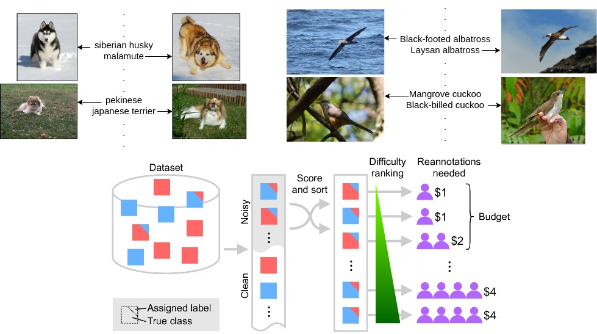

# Improving Noisy Fine-Grained Datasets using Active Label Cleaning Framework

[Avik Pal](https://palavik.github.io/)

**CVPR 2024 VDU Workshop** [[`Paper`](https://openaccess.thecvf.com/content/CVPR2024W/VDU/papers/Pal_Improving_Noisy_Fine-Grained_Datasets_using_Active_Label_Cleaning_Framework_CVPRW_2024_paper.pdf)] [[`BibTeX`](#citing-this-work)]

<p align="center"></p>

_Figure 1. Labels in Fine-grained Visual Categorization (FGVC) datasets usually have subtle differences between semantically or taxonomically related labels. Such minute differences might not be picked up by human annotators during crowd-sourcing which results in noisy labels. (Top-left) shows similar-looking images from the Stanford Dogs dataset but are categorized by different dog breeds that share the same parent in the WordNet hierarchy. (Top-right) shows images of different categories of birds from CUB-200-2011 dataset that have similar features and are related by the same type (for example, sub-species of albatross bird-type). (Bottom) provides an overview of the Active Label Cleaning (ALC) algorithm proposed by Bernhardt et al (2022)_

## Installing environment

Set-up codebase with [Conda](https://conda.io/docs/user-guide/install/download.html) using following commands:

```
git clone git@github.com:PalAvik/alclean.git
cd alclean
conda create -n alclean python=3.10 --yes
conda activate alclean
```

Then install this codebase with dependencies using following commands:

```
python3 -m pip install -r requirements.txt
python3 -m pip install -e .
```

## Datasets

The StanfordDogs (ImagenetDogs) and CUB datasets are automatically downloaded with their class scripts [`AL_cleaning/datasets/imagenetdogs.py`](AL_cleaning/datasets/imagenetdogs.py) and [`AL_cleaning/datasets/cub.py`](AL_cleaning/datasets/cub.py) correspondingly in their default root folders as indicated in [`default_paths.py`](default_paths.py). The noise rates for simulating noisy annotations can be configured in corresponding model configs in [`AL_cleaning/configs/models`](AL_cleaning/configs/models). The train-test split is randomly taken in 70%-30% ratio. The correct labels of the training sets of each are used as the clean test-set to evaluate our trained models.

## Model Training

The primary script for training the supervised model is [`AL_cleaning/training_scripts/train.py`](AL_cleaning/training_scripts/train.py). This script requires a configuration file that defines the dataset, training parameters (such as batch size, scheduler, etc.), training type, and any data augmentation to be applied. To initiate a training job, run the following command:

```
# Training the vanilla ResNet on ImagenetDogs
python AL_cleaning/training_scripts/train.py  --config AL_cleaning/configs/models/imagenetdogs_noise_20/resnet_vanilla.yaml
# Training the ResNet with co-teaching method on ImagenetDogs
python AL_cleaning/training_scripts/train.py  --config AL_cleaning/configs/models/imagenetdogs_noise_20/resnet_co_teaching.yaml

# Training the vanilla ResNet on CUB
python AL_cleaning/training_scripts/train.py  --config AL_cleaning/configs/models/cub_noise_20/resnet_vanilla.yaml
# Training the ResNet with co-teaching method on CUB
python AL_cleaning/training_scripts/train.py  --config AL_cleaning/configs/models/cub_noise_20/resnet_co_teaching.yaml
```

## Label-cleaning simulation

To run the label cleaning simulation, run [`AL_cleaning/main_simulation.py`](AL_cleaning/main_simulation.py) with a list of selector configurations provided via the `--config` argument, and a list of seeds for sampling using the `--seeds` argument. Each selector configuration allows you to specify the selector and the model configuration to be used for inference. All available selector configurations can be found in [`AL_cleaning/configs/selection`](AL_cleaning/configs/selection). Different acquisition functions can be experimented with by changing the `selector.type` in the config yaml.

For example, by running the following command, the benchmark will be executed three times (using three different seeds) for each selector specified by its configuration. In this case, two selectors are being used. The results will be found in `MAIN_SIMULATION_DIR` configured in [`default_paths.py`](default_paths.py).

```
python AL_cleaning/main_simulation.py --config AL_cleaning/configs/selection/cub_noise_20/resnet_vanilla.yaml AL_cleaning/configs/selection/cub_noise_20/resnet_co_teaching.yaml --seeds 1 12 123
```

## Model selection benchmark

The model selection benchmark [`AL_cleaning/model_selection_benchmark.py`](AL_cleaning/model_selection_benchmark.py) first evaluates the model on the original noisy validation set. Then it loads the cleaned validation labels (coming from running one selector on the noisy validation dataset) and re-runs evaluation on this cleaned dataset. The script then reports metrics for all models evaluated on both noisy and cleaned data.

Prior to running this a selector model has to be trained using one model config and then run the corresponding cleaning simulation on the validation set to get cleaned labels for the validation set using previously mentioned steps. The benchmark can then run with following command:

```
python AL_cleaning/model_selection_benchmark.py --config AL_cleaning/configs/models/cub_noise_20/resnet_co_teaching.yaml --curated-label-config AL_cleaning/configs/selection/cub_noise_20/resnet_co_teaching.yaml
```

## Citing this work

If you use any parts of this codebase in your research, please use the following BibTeX entries.

```
@inproceedings{Pal24,
  author       = {Avik Pal},
  title        = {Improving Noisy Fine-Grained Datasets using Active Label Cleaning Framework},
  booktitle    = {{IEEE/CVF} Conference on Computer Vision and Pattern Recognition,
                  {CVPR} 2024 - Workshops},
  publisher    = {{IEEE}},
  year         = {2024},
}

@article{Bernhardt22,
   title={Active label cleaning for improved dataset quality under resource constraints},
   volume={13},
   journal={Nature Communications},
   publisher={Springer Science and Business Media LLC},
   author={Bernhardt, Mélanie and Castro, Daniel C. and Tanno, Ryutaro and Schwaighofer, Anton and Tezcan, Kerem C. and Monteiro, Miguel and Bannur, Shruthi and Lungren, Matthew P. and Nori, Aditya and Glocker, Ben and Alvarez-Valle, Javier and Oktay, Ozan},
   year={2022},
}
```

This work and the [`Active label cleaning framework`](https://github.com/microsoft/InnerEye-DeepLearning/tree/1606729c7a16e1bfeb269694314212b6e2737939/InnerEye-DataQuality) are both under MIT license.
